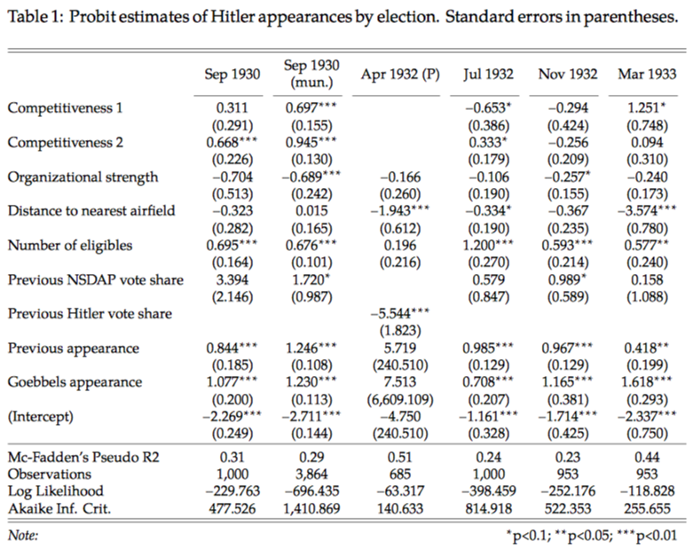

# Supplementary and replication materials for paper "Examining a Most Likely Case for Strong Campaign Effects: Hitler's Speeches and the Rise of the Nazi Party, 1927-1933"

This repository provides replication materials for the paper "Examining a Most Likely Case for Strong Campaign Effects: Hitler's Speeches and the Rise of the Nazi Party, 1927-1933" by Peter Selb and Simon Munzert.

## Paper
The current version of the corresponding working paper can be accessed here:
https://github.com/simonmunzert/hitler-speeches/raw/master/SelbMunzert_Hitler_Speeches.pdf

## Abstract
Given the devastating historical consequences, Hitler’s rise to power amidst an unprecedented propaganda campaign constitutes one of the most notorious cases for campaign effects research. Although contemporary witnesses and historians seem unanimous in recognizing the importance of Hitler’s campaign for the electoral success of the Nazi party, empirical evidence is scant. We collected data about Hitler’s speeches and gauge their impact on voter support at five national elections preced- ing the dictatorship. We use a semi-parametric difference-in-differences approach to estimate effects in the face of potential confounding due to the deliberate scheduling of events. Our findings suggest that, while Hitler’s speeches appear rationally targeted, their impact on the Nazis’ electoral fortunes were negligible. Only the 1932 presidential runoff, an election preceded by an extraordinarily short, intense and one-sided campaign, yields consistent effects. Our findings have repercussions for both modern research into campaign effects and the dominant epistemology of historical explanation.

## Preview of results

## Author information

**Peter Selb** (corresponding author)

University of Konstanz

Department of Politics and Public Administration

P.o. Box 85

D-78457 Konstanz, Germany

Email: peter.selb@uni.kn

  

**Simon Munzert** (repository maintainer)

University of Mannheim

Mannheim Centre for European Social Research

D-68131 Mannheim, Germany

E-mail: simon.munzert@mzes.uni-mannheim.de
